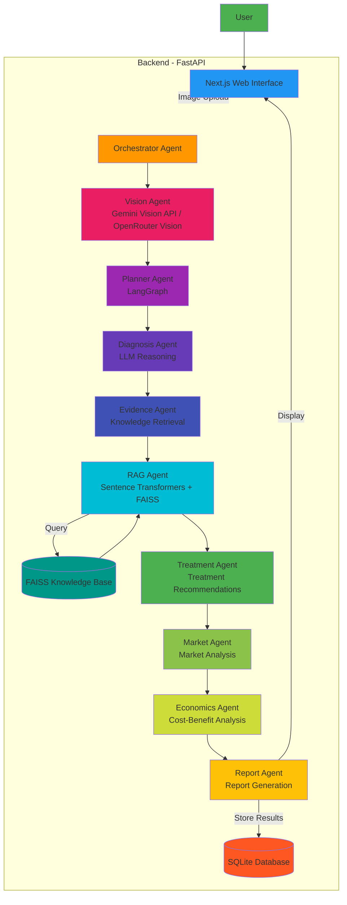

# AgriSense AI

An intelligent agricultural diagnosis and decision support system powered by multi-agent AI architecture. The system analyzes plant images, provides disease diagnoses, treatment recommendations, market insights, and economic analysis to help farmers make data-driven decisions.

## Table of Contents

- [Features](#features)
- [Technology Stack](#technology-stack)
- [Architecture Overview](#architecture-overview)
- [Agent Workflow](#agent-workflow)
- [Project Structure](#project-structure)
- [Prerequisites](#prerequisites)
- [Setup Instructions](#setup-instructions)
- [Running the Application](#running-the-application)
- [API Documentation](#api-documentation)
- [Environment Variables](#environment-variables)
- [Screenshots](#screenshots)
- [Troubleshooting](#troubleshooting)
- [Contributing](#contributing)
- [License](#license)

## Features

- **AI-Powered Plant Disease Diagnosis**: Upload plant images for instant disease identification using computer vision
- **Multi-Agent Architecture**: Specialized AI agents for diagnosis, treatment, market analysis, and economic insights
- **RAG-Based Knowledge Retrieval**: Context-aware recommendations using agricultural knowledge base
- **Real-Time System Monitoring**: Dashboard for tracking system health and agent performance
- **Treatment Recommendations**: Personalized treatment plans based on diagnosis results
- **Market Intelligence**: Crop market trends, pricing, and demand analysis
- **Economic Analysis**: Cost-benefit analysis and ROI projections for treatments
- **Comprehensive Reporting**: Detailed reports with actionable insights

## Technology Stack

### Backend
- **Framework**: FastAPI 0.110.3
- **AI/ML**: LangChain, LangGraph, LangChain Community
- **Vision**: OpenCV, Pillow, NumPy
- **RAG**: FAISS, Sentence Transformers
- **Database**: SQLite with SQLAlchemy 2.0
- **LLM Integration**: 
  - Google Gemini Vision API
  - OpenRouter (Qwen, GPT-4o-mini)
- **Testing**: Pytest, Pytest-asyncio, Pytest-cov
- **Logging**: Structlog

### Frontend
- **Framework**: Next.js 15.0.0 with React 19
- **Language**: TypeScript
- **Styling**: TailwindCSS 3.4
- **State Management**: Zustand
- **Data Fetching**: TanStack React Query
- **Animations**: Framer Motion
- **Icons**: Lucide React
- **Charts**: Recharts
- **Markdown**: React Markdown

## Architecture Overview

AgriSense AI follows a multi-agent architecture where specialized AI agents collaborate to provide comprehensive agricultural insights:



## Agent Workflow

The multi-agent system follows a sequential workflow to process diagnosis requests:

```mermaid
flowchart LR
    Start[User Uploads Image] --> Vision[Vision Agent<br/>OpenRouter Vision + Gemini Vision]
    Vision -->|Visual Features & Symptoms| Planner[Planner Agent<br/>LangGraph Workflow Engine]
    Planner --> DiagnosisAgent[Diagnosis Agent<br/>Disease Identification]
    DiagnosisAgent -->|Disease Information| Evidence[Evidence Agent<br/>Scientific Evidence Retrieval]
    Evidence -->|Evidence Data| RAG[RAG Agent<br/>Context-Aware Retrieval]
    RAG -->|Query| FAISS[(FAISS Vector Index)]
    FAISS -->|Relevant Documents| RAG
    RAG -->|Knowledge Context| Treatment[Treatment Agent<br/>Treatment Recommendations]
    Treatment -->|Treatment Plan| Market[Market Agent<br/>Market Trends & Pricing]
    Market -->|Market Data| Economics[Economics Agent<br/>ROI & Cost-Benefit Analysis]
    Economics -->|Economic Insights| Report[Report Agent<br/>Comprehensive Report]
    Report -->|Store| SQLite[(SQLite Database)]
    Report -->|Display| Dashboard[Dashboard & Results]
    
    style Start fill:#4CAF50
    style Vision fill:#E91E63
    style Planner fill:#9C27B0
    style DiagnosisAgent fill:#673AB7
    style Evidence fill:#3F51B5
    style RAG fill:#00BCD4
    style FAISS fill:#009688
    style Treatment fill:#4CAF50
    style Market fill:#8BC34A
    style Economics fill:#CDDC39
    style Report fill:#FFC107
    style SQLite fill:#FF5722
    style Dashboard fill:#2196F3
```



### Agent Details

**1. Vision Agent**
- **Purpose**: Analyzes uploaded plant images using computer vision
- **Input**: Plant image file
- **Output**: Visual features, symptom detection, initial observations
- **Technology**: Gemini Vision API / OpenRouter Vision API

**2. Planner Agent**
- **Purpose**: Creates execution plan for the diagnosis workflow
- **Input**: User request, image analysis results
- **Output**: Structured plan with agent execution order
- **Technology**: LangGraph planning

**3. Diagnosis Agent**
- **Purpose**: Provides primary disease diagnosis based on visual analysis
- **Input**: Image features, symptoms
- **Output**: Disease identification, confidence scores
- **Technology**: LLM reasoning with vision context

**4. Evidence Agent**
- **Purpose**: Gathers supporting evidence from knowledge base
- **Input**: Diagnosis results, disease name
- **Output**: Scientific evidence, research papers, case studies
- **Technology**: RAG with FAISS vector search

**5. RAG Agent**
- **Purpose**: Retrieves relevant agricultural knowledge
- **Input**: Disease context, symptoms
- **Output**: Treatment guidelines, best practices, expert recommendations
- **Technology**: Sentence Transformers + FAISS

**6. Treatment Agent**
- **Purpose**: Generates personalized treatment recommendations
- **Input**: Diagnosis, evidence, knowledge base results
- **Output**: Treatment plans, medications, preventive measures
- **Technology**: LLM with agricultural knowledge

**7. Market Agent**
- **Purpose**: Analyzes market trends and crop economics
- **Input**: Crop type, disease impact
- **Output**: Market prices, demand forecasts, supply chain insights
- **Technology**: Market data analysis

**8. Economics Agent**
- **Purpose**: Performs cost-benefit analysis
- **Input**: Treatment costs, market data, crop value
- **Output**: ROI projections, economic impact assessment
- **Technology**: Economic modeling

**9. Report Agent**
- **Purpose**: Compiles all insights into comprehensive report
- **Input**: All agent outputs
- **Output**: Structured report with recommendations
- **Technology**: Document generation

## Project Structure

```
agrisense-ai/
├── backend/
│   ├── app/
│   │   ├── agents/              # Multi-agent system
│   │   │   ├── base.py          # Base agent class
│   │   │   ├── vision.py        # Vision analysis agent
│   │   │   ├── planner.py       # Workflow planning agent
│   │   │   ├── diagnosis.py     # Disease diagnosis agent
│   │   │   ├── evidence.py      # Evidence gathering agent
│   │   │   ├── rag_agent.py     # RAG retrieval agent
│   │   │   ├── treatment_agent.py   # Treatment recommendation agent
│   │   │   ├── market_agent.py  # Market analysis agent
│   │   │   ├── economics_agent.py   # Economic analysis agent
│   │   │   ├── report_agent.py  # Report generation agent
│   │   │   ├── orchestrator.py  # Agent orchestration
│   │   │   ├── workflow.py      # LangGraph workflow definition
│   │   │   └── state.py         # Shared state management
│   │   ├── api/                 # REST API endpoints
│   │   │   ├── health.py        # Health check endpoints
│   │   │   ├── diagnosis.py     # Diagnosis endpoints
│   │   │   └── agents.py        # Agent status endpoints
│   │   ├── database/            # Database configuration
│   │   │   ├── connection.py    # Database connection
│   │   │   └── session.py       # Session management
│   │   ├── llm/                 # LLM integration
│   │   │   ├── gemini.py        # Gemini API client
│   │   │   └── openrouter.py    # OpenRouter API client
│   │   ├── models/              # Database models
│   │   │   ├── agent.py         # Agent metrics model
│   │   │   ├── diagnosis.py     # Diagnosis record model
│   │   │   ├── llm.py           # LLM configuration model
│   │   │   └── common.py        # Common models
│   │   ├── rag/                 # RAG system
│   │   │   ├── embedder.py      # Text embedding
│   │   │   ├── retriever.py     # Vector retrieval
│   │   │   ├── index.py         # FAISS index management
│   │   │   ├── chunker.py       # Document chunking
│   │   │   └── loader.py        # Document loading
│   │   ├── services/            # Business logic services
│   │   │   ├── diagnosis_service.py    # Diagnosis logic
│   │   │   ├── gemini_vision_service.py # Gemini vision service
│   │   │   └── openrouter_vision_service.py # OpenRouter vision
│   │   ├── utils/               # Utility functions
│   │   ├── config.py            # Application configuration
│   │   └── main.py              # FastAPI application entry
│   ├── data/
│   │   ├── documents/           # Agricultural knowledge documents
│   │   │   ├── late_blight.md
│   │   │   ├── sugarcane_red_rot.md
│   │   │   ├── sheath_blight.md
│   │   │   ├── early_blight.md
│   │   │   ├── cotton_boll_rot.md
│   │   │   ├── chickpea_wilt.md
│   │   │   ├── citrus_canker.md
│   │   │   ├── northern_corn_leaf_blight.md
│   │   │   ├── septoria_leaf_spot.md
│   │   │   ├── banana_panama_disease.md
│   │   │   ├── mango_anthracnose.md
│   │   │   ├── leaf_blast.md
│   │   │   ├── groundnut_leaf_spot.md
│   │   │   └── soybean_rust.md
│   │   └── faiss_index/         # FAISS vector index
│   │       ├── index.faiss
│   │       ├── chunks.json
│   │       └── manifest.json
│   ├── migrations/              # Database migrations
│   ├── tests/                   # Backend tests
│   │   ├── test_agents.py
│   │   ├── test_rag.py
│   │   ├── test_api.py
│   │   ├── test_openrouter_client.py
│   │   ├── test_base_agent.py
│   │   ├── test_economics_market.py
│   │   └── test_treatment_agents.py
│   ├── requirements.txt         # Python dependencies
│   ├── pyproject.toml           # Python project config
│   ├── alembic.ini              # Alembic migration config
│   └── .env.example             # Environment variables template
├── frontend/
│   ├── src/
│   │   ├── app/                 # Next.js app router
│   │   │   ├── dashboard/
│   │   │   │   └── page.tsx     # Dashboard page
│   │   │   ├── diagnosis/
│   │   │   │   └── page.tsx     # Diagnosis page
│   │   │   ├── analytics/      # Analytics page
│   │   │   ├── history/        # Diagnosis history
│   │   │   ├── knowledge-base/ # Knowledge base page
│   │   │   ├── settings/       # Settings page
│   │   │   ├── layout.tsx      # Root layout
│   │   │   ├── page.tsx        # Home page
│   │   │   ├── globals.css     # Global styles
│   │   │   └── favicon.ico     # Favicon
│   │   ├── components/         # React components
│   │   │   ├── layout/
│   │   │   │   └── navbar.tsx  # Navigation bar
│   │   │   ├── pages/
│   │   │   │   └── diagnosis/  # Diagnosis page components
│   │   │   │       ├── EconomicsChart.tsx
│   │   │   │       ├── EvidenceChain.tsx
│   │   │   │       ├── MarketAnalysisPanel.tsx
│   │   │   │       ├── ObservationsPanel.tsx
│   │   │   │       ├── PlannerPanel.tsx
│   │   │   │       ├── RagEvidencePanel.tsx
│   │   │   │       ├── ReportExport.tsx
│   │   │   │       ├── ReportPanel.tsx
│   │   │   │       ├── ResultsPanel.tsx
│   │   │   │       ├── TreatmentTable.tsx
│   │   │   │       └── reportUtils.ts
│   │   │   ├── ui/             # UI components
│   │   │   │   ├── button.tsx
│   │   │   │   ├── card.tsx
│   │   │   │   ├── input.tsx
│   │   │   │   └── spinner.tsx
│   │   │   └── providers.tsx   # Context providers
│   │   ├── hooks/              # Custom React hooks
│   │   │   ├── useApi.ts
│   │   │   ├── useDiagnosis.ts
│   │   │   └── useHealth.ts
│   │   ├── lib/                # Utility libraries
│   │   │   ├── cn.ts           # Class name utility
│   │   │   └── constants.ts    # Constants
│   │   ├── store/              # State management (Zustand)
│   │   │   └── diagnosis.ts    # Diagnosis state store
│   │   ├── styles/             # Additional styles
│   │   │   ├── grid.css         # Grid layout styles
│   │   │   └── tokens.css      # Design tokens
│   │   └── types/              # TypeScript type definitions
│   │       ├── api.ts          # API types
│   │       └── index.ts         # General types
│   ├── public/                 # Static assets
│   │   ├── file.svg
│   │   ├── globe.svg
│   │   └── next.svg
│   ├── package.json            # Node dependencies
│   ├── tsconfig.json           # TypeScript config
│   ├── tailwind.config.ts      # TailwindCSS config
│   ├── next.config.ts          # Next.js config
│   ├── eslint.config.mjs       # ESLint config
│   ├── postcss.config.mjs      # PostCSS config
│   ├── prettierrc.json         # Prettier config
│   └── .env.local              # Frontend environment variables
├── .gitignore                  # Git ignore rules
├── ARCHITECTURE.md             # Detailed architecture documentation
├── PROJECT_DOCUMENTATION.md    # Project documentation
└── README.md                   # This file
```

## Prerequisites

### Backend
- Python 3.10 or higher
- pip (Python package manager)
- Virtual environment (recommended)

### Frontend
- Node.js 18 or higher
- npm or yarn package manager

### External Services
- Google Gemini API Key (for vision analysis)
- OpenRouter API Key (for LLM and alternative vision)

## Setup Instructions

### 1. Clone the Repository

```bash
git clone <repository-url>
cd agrisense-ai
```

### 2. Backend Setup

#### Create Virtual Environment

```bash
cd backend
python -m venv venv
source venv/bin/activate  # On Windows: venv\Scripts\activate
```

#### Install Dependencies

```bash
pip install -r requirements.txt
```

#### Configure Environment Variables

Copy the example environment file and configure it:

```bash
cp .env.example .env
```

Edit `.env` with your configuration:

```env
# Environment
ENVIRONMENT=development
DEBUG=false
LOG_LEVEL=INFO

# Server
API_HOST=0.0.0.0
API_PORT=8000

# Database
DATABASE_URL=sqlite:///./agrisense.db
SQL_ECHO=false

# Gemini Vision
GEMINI_API_KEY=your_gemini_api_key_here
GEMINI_BASE_URL=https://generativelanguage.googleapis.com/v1beta
GEMINI_MODEL=gemini-2.0-flash-exp

# OpenRouter
OPENROUTER_API_KEY=your_openrouter_api_key_here
OPENROUTER_BASE_URL=https://openrouter.ai/api/v1
OPENROUTER_MODEL=qwen/qwen3-next-80b-a3b-instruct:free

# RAG
FAISS_INDEX_PATH=./data/faiss_index
DOCUMENTS_PATH=./data/documents
RAG_EMBEDDING_MODEL=all-MiniLM-L6-v2
```

#### Initialize Database

```bash
# Run database migrations
alembic upgrade head
```

### 3. Frontend Setup

#### Install Dependencies

```bash
cd frontend
npm install
```

#### Configure Environment Variables

Create `.env.local` in the frontend directory:

```env
NEXT_PUBLIC_API_URL=http://localhost:8000
```

## Running the Application

### Start Backend Server

```bash
cd backend
source venv/bin/activate  # If not already activated
uvicorn app.main:app --reload --host 0.0.0.0 --port 8000
```

The backend API will be available at `http://localhost:8000`

### Start Frontend Development Server

```bash
cd frontend
npm run dev
```

The frontend application will be available at `http://localhost:3000`

### Access the Application

1. Open your browser and navigate to `http://localhost:3000`
2. You will see the dashboard with system health status
3. Navigate to the Diagnosis page to upload plant images for analysis

## API Documentation

Once the backend is running, access the interactive API documentation:

- **Swagger UI**: `http://localhost:8000/docs`
- **ReDoc**: `http://localhost:8000/redoc`

### Key API Endpoints

#### Health Check
- `GET /api/health` - System health status
- `GET /api/health/agents` - Agent status metrics

#### Diagnosis
- `POST /api/diagnosis/analyze` - Analyze plant image for disease diagnosis
  - Request: `multipart/form-data` with image file
  - Response: Diagnosis results with treatment recommendations

#### Agent Status
- `GET /api/agents/status` - Get all agent metrics
- `GET /api/agents/{agent_name}` - Get specific agent metrics

## Environment Variables

### Backend (.env)

| Variable | Description | Default | Required |
|----------|-------------|---------|----------|
| `ENVIRONMENT` | Environment (development/staging/production) | development | No |
| `DEBUG` | Enable debug mode | false | No |
| `LOG_LEVEL` | Logging level (DEBUG/INFO/WARNING/ERROR) | INFO | No |
| `API_HOST` | API server host | 0.0.0.0 | No |
| `API_PORT` | API server port | 8000 | No |
| `DATABASE_URL` | Database connection URL | sqlite:///./agrisense.db | No |
| `GEMINI_API_KEY` | Google Gemini API key | None | Yes |
| `OPENROUTER_API_KEY` | OpenRouter API key | None | Yes |
| `FAISS_INDEX_PATH` | Path to FAISS index | ./data/faiss_index | No |
| `DOCUMENTS_PATH` | Path to documents | ./data/documents | No |

### Frontend (.env.local)

| Variable | Description | Default | Required |
|----------|-------------|---------|----------|
| `NEXT_PUBLIC_API_URL` | Backend API URL | http://localhost:8000 | Yes |

## Screenshots

### Dashboard

*System health monitoring and quick actions*

### Diagnosis Page

*Plant image upload and AI analysis*

### Diagnosis Results

*Comprehensive diagnosis with treatment recommendations*

### Agent Status

*Real-time agent performance metrics*

*Note: Screenshots will be added as the application is developed*

## Troubleshooting

### Backend Issues

**Problem**: Backend fails to start
- **Solution**: Check if port 8000 is already in use
- **Solution**: Verify all environment variables are set correctly
- **Solution**: Ensure Python 3.10+ is installed

**Problem**: Database connection error
- **Solution**: Run `alembic upgrade head` to initialize database
- **Solution**: Check DATABASE_URL in .env file

**Problem**: API key errors
- **Solution**: Verify GEMINI_API_KEY and OPENROUTER_API_KEY are set
- **Solution**: Check API key validity and permissions

### Frontend Issues

**Problem**: Frontend fails to connect to backend
- **Solution**: Verify NEXT_PUBLIC_API_URL is correct
- **Solution**: Ensure backend is running on the specified port
- **Solution**: Check CORS settings in backend

**Problem**: Build errors
- **Solution**: Run `npm install` to ensure all dependencies are installed
- **Solution**: Clear Next.js cache: `rm -rf .next`

### Agent Issues

**Problem**: Agents return errors
- **Solution**: Check agent logs in backend console
- **Solution**: Verify LLM API keys are valid
- **Solution**: Ensure FAISS index is built and accessible

## Development

### Running Tests

**Backend Tests**:
```bash
cd backend
pytest
pytest --cov=app  # With coverage
```

**Frontend Tests**:
```bash
cd frontend
npm test
```

### Code Formatting

**Backend**:
```bash
cd backend
ruff check app/
ruff format app/
```

**Frontend**:
```bash
cd frontend
npm run format
npm run lint
```

### Database Migrations

Create new migration:
```bash
cd backend
alembic revision --autogenerate -m "description"
```

Apply migrations:
```bash
alembic upgrade head
```

## Contributing

1. Fork the repository
2. Create a feature branch (`git checkout -b feature/amazing-feature`)
3. Commit your changes (`git commit -m 'Add amazing feature'`)
4. Push to the branch (`git push origin feature/amazing-feature`)
5. Open a Pull Request

## License

This project is licensed under the MIT License.

## Support

For support and questions, please open an issue in the repository or contact the development team.

---

**Built with ❤️ for sustainable agriculture**
