# AgriSense

An AI-powered agricultural diagnosis system that analyzes plant images to detect diseases and provide comprehensive treatment recommendations with market insights and economic analysis.

## Overview

AgriSense is an intelligent agricultural decision support system that leverages a multi-agent AI architecture to help farmers make data-driven decisions. The system combines computer vision, large language models, and retrieval-augmented generation (RAG) to provide:

- **Disease Detection**: AI-powered analysis of plant images to identify diseases with high accuracy
- **Treatment Recommendations**: Personalized treatment plans based on diagnosis and agricultural knowledge base
- **Market Intelligence**: Real-time crop pricing, demand forecasts, and supply chain insights
- **Economic Analysis**: Cost-benefit analysis and ROI projections for treatment options
- **Evidence-Based Insights**: Scientific evidence and research papers supporting diagnoses
- **Knowledge Retrieval**: Context-aware recommendations using agricultural knowledge base

The system uses a sequential multi-agent workflow where specialized AI agents collaborate to transform a simple plant image upload into a comprehensive agricultural report with actionable insights.

## Tech Stack

### Backend

**Core Framework**
- **FastAPI 0.110.3** - Modern, fast web framework for building APIs with automatic validation and documentation
- **Uvicorn** - ASGI server for running FastAPI applications
- **Pydantic 2.7.4** - Data validation using Python type annotations
- **Pydantic Settings** - Environment-based configuration management

**AI/ML Framework**
- **LangChain 0.2.11** - Framework for building LLM-powered applications
- **LangGraph 0.2.14** - Stateful, multi-actor applications with LLMs (workflow orchestration)
- **LangChain Community 0.2.10** - Community integrations for LangChain
- **LangChain Core 0.2.27** - Core abstractions and base classes

**Computer Vision**
- **OpenCV 4.10.0.84** - Image processing and computer vision operations
- **Pillow 10.4.0** - Python Imaging Library for image manipulation
- **NumPy 1.26.4** - Numerical computing and array operations

**RAG System**
- **FAISS 1.8.0.post1** - Facebook AI Similarity Search for efficient vector similarity search
- **Sentence Transformers 3.0.1** - State-of-the-art embeddings for semantic search

**Database**
- **SQLAlchemy 2.0.31** - SQL toolkit and ORM for database operations
- **Alembic 1.13.2** - Database migration tool
- **SQLite** - Lightweight, file-based database (default)

**LLM Integration**
- **OpenRouter API** - Unified API for multiple LLM providers (Llama 3.3-70B, GPT-4o-mini for vision)

**Utilities**
- **python-dotenv** - Load environment variables from .env files
- **python-multipart** - Multipart form data support for file uploads
- **structlog** - Structured logging for better observability

**Testing**
- **pytest 8.2.2** - Testing framework
- **pytest-asyncio 0.23.8** - Async support for pytest
- **pytest-cov 5.0.0** - Code coverage plugin
- **httpx 0.27.0** - Async HTTP client for testing

### Frontend

**Core Framework**
- **Next.js 15.0.0** - React framework with server components and app router
- **React 19.0.0** - UI library
- **TypeScript 5.3.0** - Type-safe JavaScript

**Styling**
- **TailwindCSS 3.4.0** - Utility-first CSS framework
- **Tailwind Typography** - Beautiful typography plugin
- **Tailwind Animate** - Animation utilities

**State Management**
- **Zustand 4.4.0** - Lightweight state management
- **TanStack React Query 5.28.0** - Server state management and data fetching

**UI Components**
- **Lucide React 0.292.0** - Beautiful icon library
- **Framer Motion 10.16.0** - Production-ready motion library for React
- **Recharts 2.10.0** - Composable charting library
- **React Markdown 10.1.0** - Markdown renderer for React

**Utilities**
- **Axios 1.6.0** - HTTP client for API requests
- **clsx + tailwind-merge** - Conditional class name utilities
- **class-variance-authority** - Variant-based component styling

**Development**
- **ESLint** - Code linting
- **Prettier** - Code formatting
- **PostCSS** - CSS transformation

## System Architecture

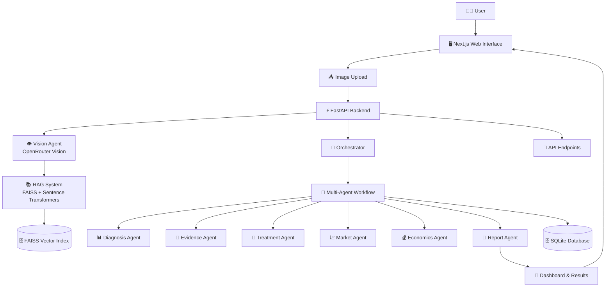

## Agent Workflow

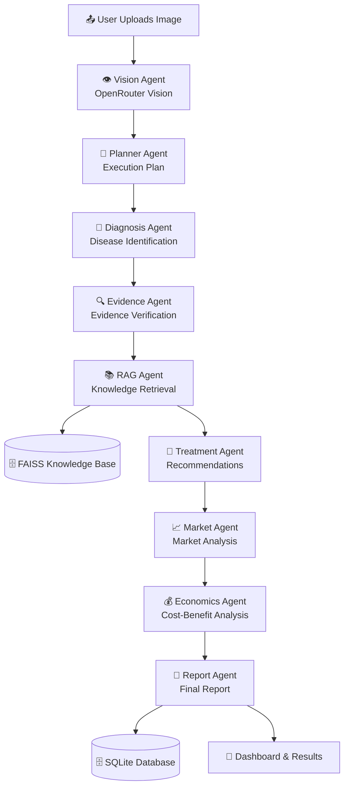

### Agent Responsibilities

**1. Vision Agent**
- Analyzes uploaded plant images using computer vision
- Detects visual symptoms and patterns
- Provides image quality assessment
- Can auto-detect crop type from image
- Uses OpenRouter Vision API (GPT-4o-mini)

**2. Planner Agent**
- Creates execution plan for diagnosis workflow
- Analyzes observations and image quality
- Determines follow-up questions if needed
- Structures the diagnostic approach
- Uses LangGraph for workflow planning

**3. Diagnosis Agent**
- Identifies potential diseases from visual observations
- Generates disease candidates with confidence scores
- Provides primary disease diagnosis
- Uses LLM reasoning with vision context

**4. Evidence Agent**
- Verifies diagnosis with scientific evidence
- Gathers supporting evidence from knowledge base
- Builds evidence chain for verification
- Confirms or refines the diagnosis

**5. RAG Agent**
- Retrieves relevant agricultural knowledge from vector database
- Uses FAISS for efficient similarity search
- Leverages Sentence Transformers for embeddings
- Provides treatment guidelines and best practices

**6. Treatment Agent**
- Generates personalized treatment recommendations
- Synthesizes RAG results with diagnosis
- Provides medications, dosages, and preventive measures
- Creates actionable treatment plans

**7. Market Agent**
- Analyzes market trends for the affected crop
- Provides current pricing information
- Offers demand forecasts and supply chain insights
- Considers location-specific market data

**8. Economics Agent**
- Performs cost-benefit analysis of treatment options
- Calculates ROI projections
- Considers yield potential and market prices
- Provides economic impact assessment

**9. Report Agent**
- Compiles all agent outputs into comprehensive report
- Structures findings with clear recommendations
- Includes evidence chain and treatment plans
- Generates final actionable report

## Project Structure

```
agrisense-ai/
├── backend/                 # Python FastAPI backend
│   ├── app/
│   │   ├── agents/         # AI agents (vision, diagnosis, treatment, etc.)
│   │   ├── api/            # REST endpoints
│   │   ├── database/       # Database configuration
│   │   ├── llm/            # LLM integration (OpenRouter)
│   │   ├── models/         # Database models
│   │   ├── rag/            # RAG system (FAISS, embeddings)
│   │   └── services/       # Business logic
│   ├── data/
│   │   ├── documents/      # Agricultural knowledge documents
│   │   └── faiss_index/    # Vector index
│   └── requirements.txt
├── frontend/               # Next.js frontend
│   ├── src/
│   │   ├── app/           # Pages (dashboard, diagnosis, etc.)
│   │   ├── components/    # React components
│   │   ├── hooks/         # Custom hooks
│   │   └── store/         # Zustand stores
│   └── package.json
└── README.md
```

## Prerequisites

- **Python 3.10+** - For backend
- **Node.js 18+** - For frontend
- **pip** - Python package manager
- **npm** - Node package manager
- **OpenRouter API Key** - For LLM and Vision services

## Installation

### 1. Clone the Repository

```bash
git clone https://github.com/arshsolkar5/agricultural-disease-diagnosis-ai.git
cd agrisense-ai
```

### 2. Backend Installation

#### Step 1: Create Virtual Environment

```bash
cd backend
python -m venv venv

# On macOS/Linux:
source venv/bin/activate

# On Windows:
venv\Scripts\activate
```

#### Step 2: Install Python Dependencies

```bash
pip install --upgrade pip
pip install -r requirements.txt
```

**Verify installation:**
```bash
python -c "import fastapi; import langchain; print('Dependencies installed successfully')"
```

#### Step 3: Configure Environment Variables

```bash
cp .env.example .env
```

Edit `.env` file and add your API keys:

```env
# Required API Key
OPENROUTER_API_KEY=your_openrouter_api_key_here
```

**Get API Key:**
- OpenRouter: https://openrouter.ai/keys

#### Step 4: Initialize Database

```bash
alembic upgrade head
```

**Verify database:**
```bash
ls -la agrisense.db  # Should show the database file in backend directory
```

#### Step 5: Start Backend Server

```bash
# Make sure you're still in the backend directory
uvicorn app.main:app --reload --host 0.0.0.0 --port 8000
```

**Verify backend is running:**
```bash
curl http://localhost:8000/health
# Should return: {"status":"healthy"}
```

### 3. Frontend Installation

#### Step 1: Install Node Dependencies

```bash
cd frontend
npm install
```

**Verify installation:**
```bash
npm list next react typescript
```

#### Step 2: Configure Environment Variables

Create `.env.local` file (if it doesn't exist):

```bash
# Check if file exists first, then create if needed
if [ ! -f .env.local ]; then
  echo "NEXT_PUBLIC_API_URL=http://localhost:8000" > .env.local
else
  echo ".env.local already exists - please verify NEXT_PUBLIC_API_URL is set correctly"
fi
```

Or manually create/edit `.env.local`:

```env
NEXT_PUBLIC_API_URL=http://localhost:8000
```

#### Step 3: Start Frontend Development Server

```bash
npm run dev
```

**Verify frontend is running:**
- Open browser to `http://localhost:3000`
- You should see the AgriSense dashboard

### 4. Verify Full Setup

1. Backend running at `http://localhost:8000`
2. Frontend running at `http://localhost:3000`
3. API docs accessible at `http://localhost:8000/docs`
4. Database initialized (`agrisense.db` exists)

## Environment Variables

### Backend (.env)
- `OPENROUTER_API_KEY` - OpenRouter API key (required)
- `OPENROUTER_MODEL` - LLM model (default: meta-llama/llama-3.3-70b-instruct)
- `OPENROUTER_VISION_MODEL` - Vision model (default: openai/gpt-4o-mini)
- `DATABASE_URL` - SQLite database path (default: sqlite:///./agrisense.db)
- `FAISS_INDEX_PATH` - Path to FAISS index (default: ./data/faiss_index)

### Frontend (.env.local)
- `NEXT_PUBLIC_API_URL` - Backend API URL (default: http://localhost:8000)

## Running the Application

1. Start backend: `cd backend && uvicorn app.main:app --reload --port 8000`
2. Start frontend: `cd frontend && npm run dev`
3. Open browser: `http://localhost:3000`

## API Documentation

- Swagger UI: `http://localhost:8000/docs`
- ReDoc: `http://localhost:8000/redoc`

## Key Endpoints

- `POST /api/diagnosis/analyze` - Analyze plant image
- `GET /api/health` - System health check
- `GET /api/agents/status` - Agent metrics

## Screenshots

### Home Page
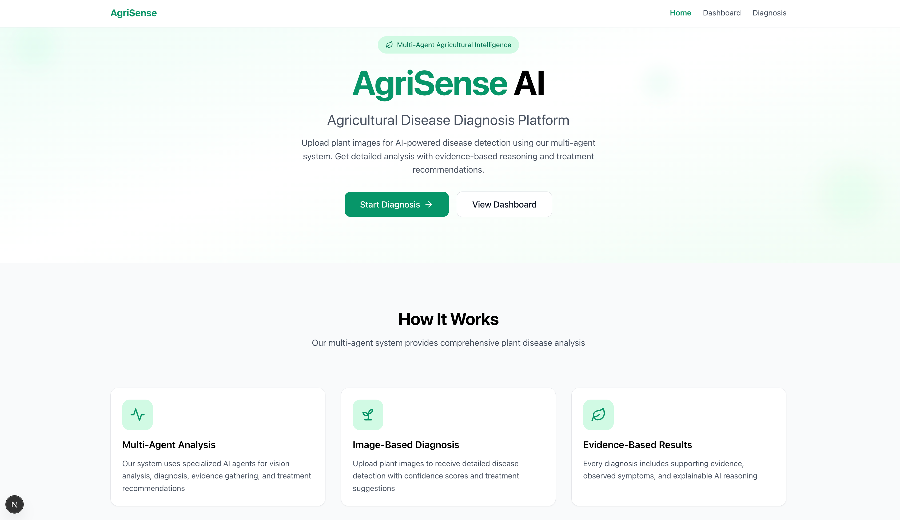

### Dashboard
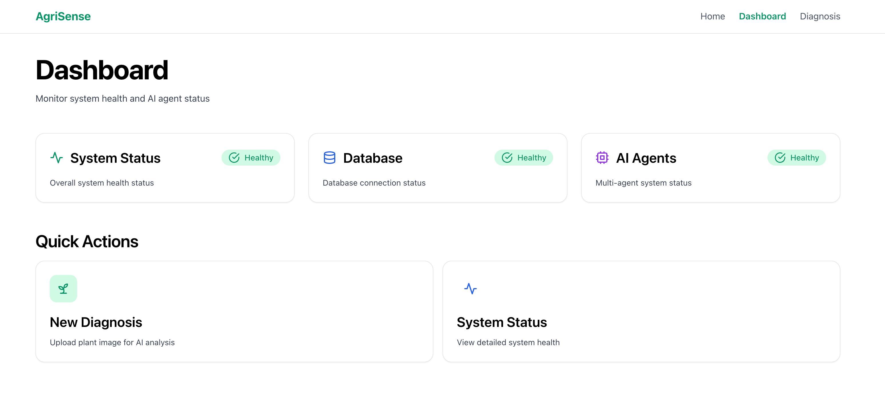

### Diagnosis Results
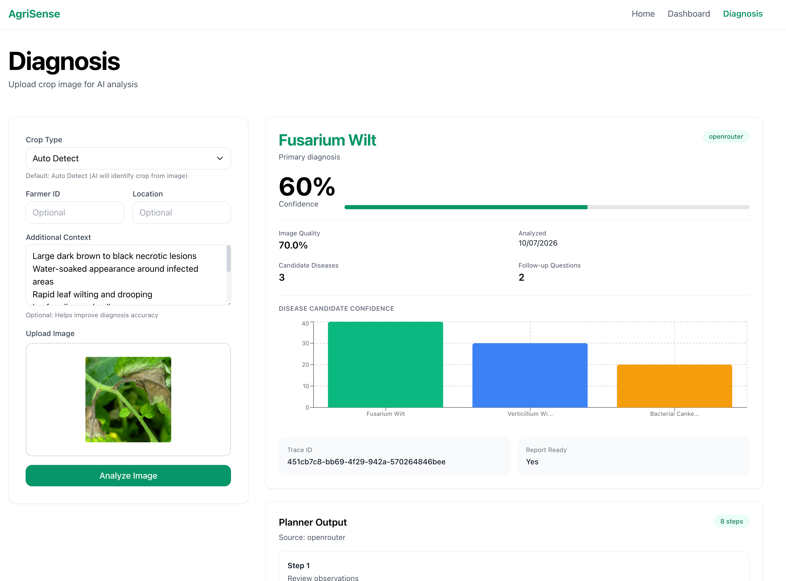
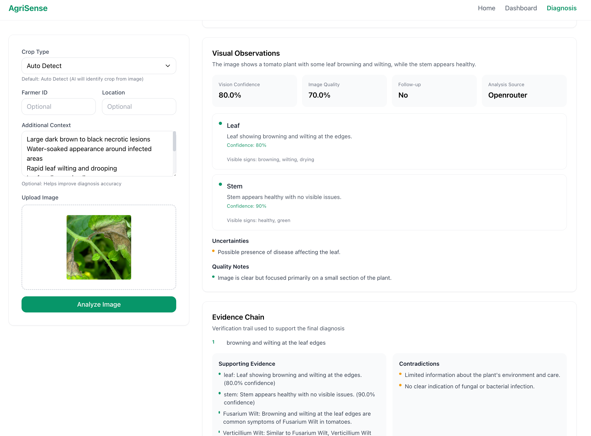
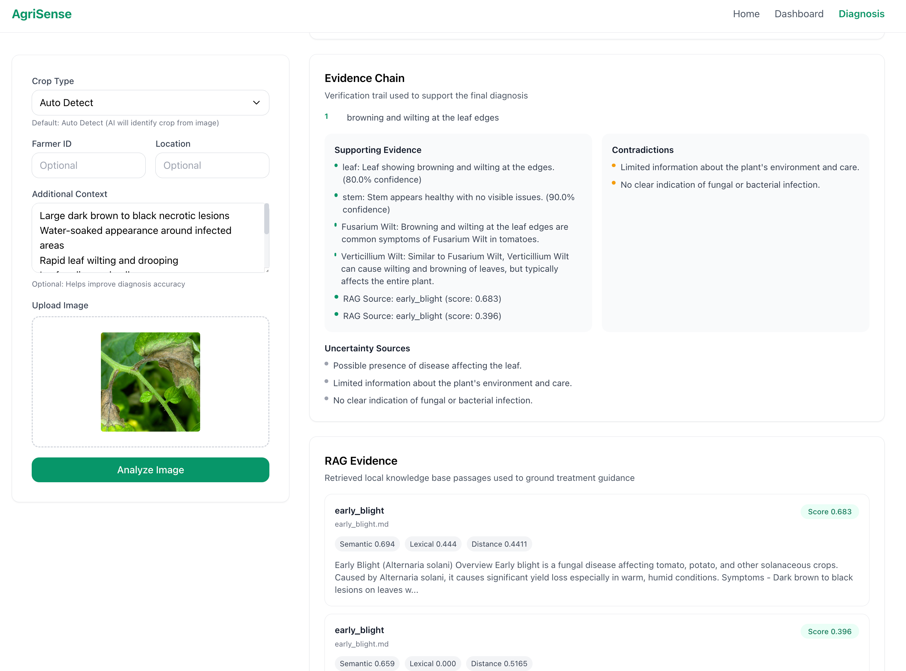
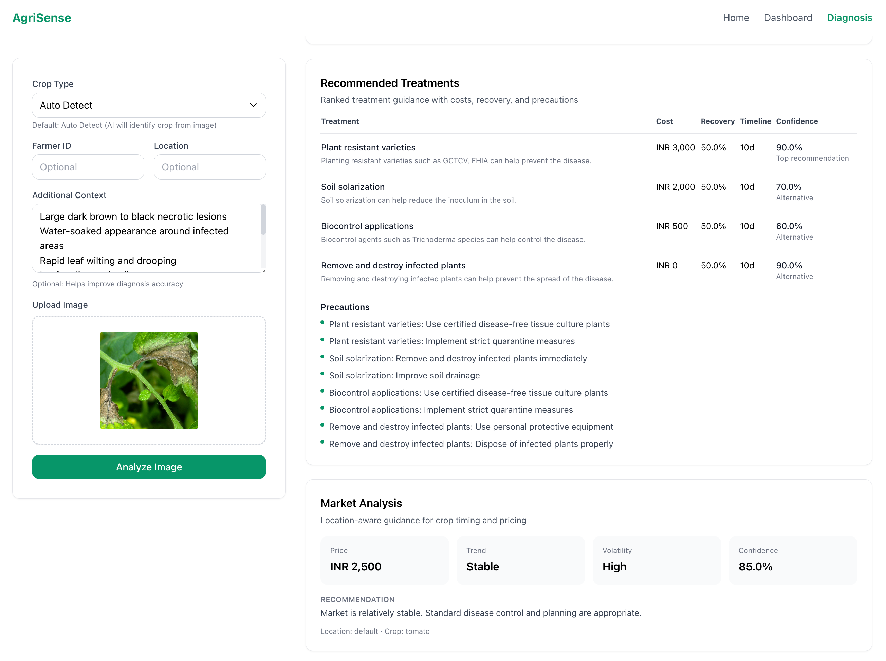
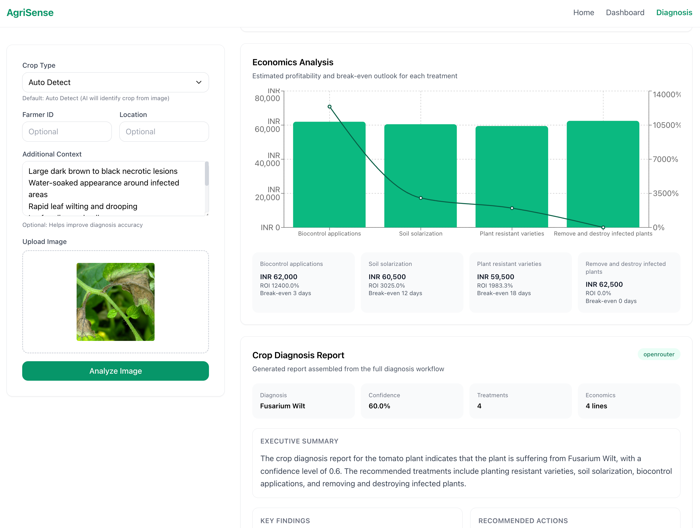
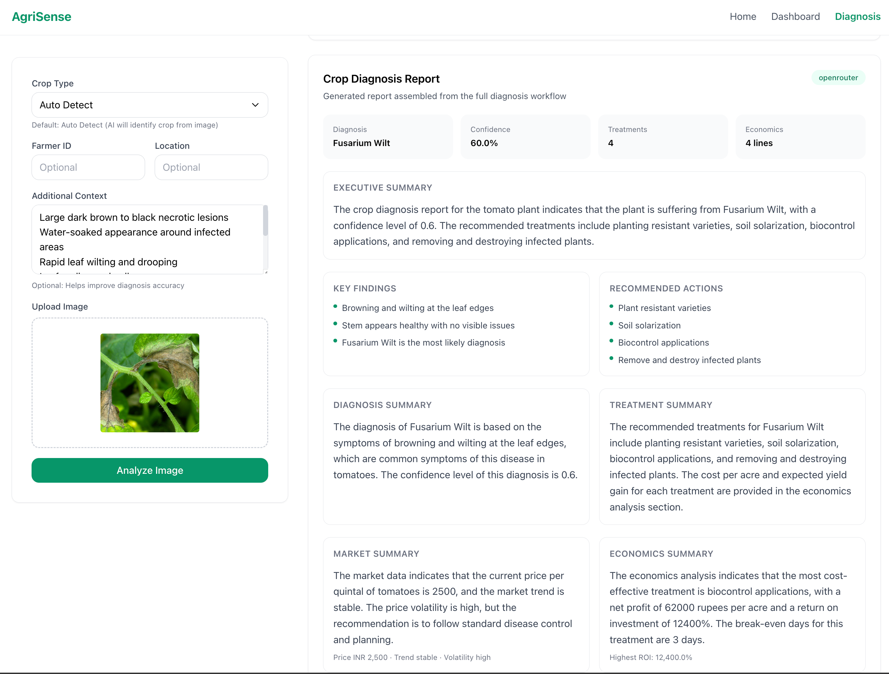

### PDF Report
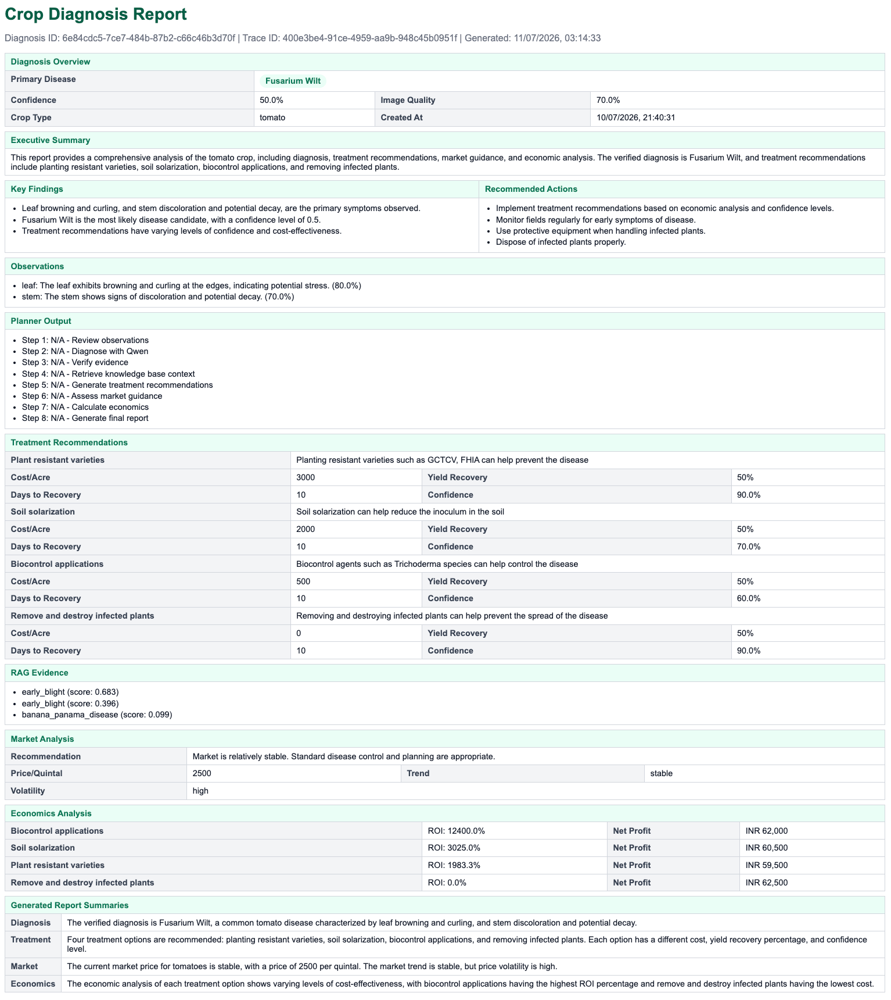
